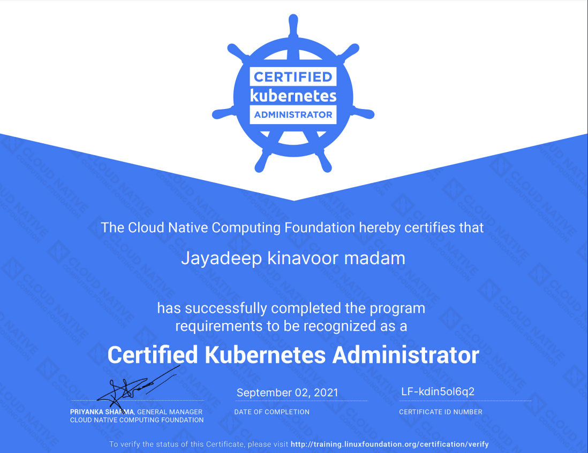

# CKA Learning Repo

My notes and preparation materials for Certified Kubernetes Administrator Exam. This repo may also contain additional resources and links which are not related to CKA, but generally useful for Kubernetes administration

Update: I passed CKA exam with 95% score! Here is the screenshot




# Folder structure

* README.md - outline, plan, structure etc.
* notes/ - Notes I prepared while learning, based on curriculm. They are organized on the order of curriculm and have a number prefix. There are some additional notes I added randomly, they won't have this number prefix
* tests/ - Practice tests I went through and their solution. In the order of curriculm
* yamls/ - Yaml files, certs etc. I created as part of the practice tests
* lxc.md - instructions to setup lxc containers
* kubernetes-hard-way-\*.md - Instructions I followed to setup kubernetes based on the famous `kubernetes the hard way` guide

# Things to learn and research

* LXC containers
* Kubernetes the hard way <https://github.com/kelseyhightower/kubernetes-the-hard-way>
* [killer.sh] Possibly a good way to experience the exam environment. Need to check if it provides free access
* <https://github.com/alijahnas/CKA-practice-exercises>
* [https://medium.com/@pmvk/tips-to-crack-certified-kubernetes-administrator-cka-exam-c949c7a9bea1]
* play with kind
* RBAC and certificates and stuff
* PriorityClass, ResourceQuotas, NetworkPolicy
* Generators for yaml
* jq and yq
* Explore jsonpath
* Learn kustomize
* awk, grep regex, xargs etc

# Links from killer.sh

Resources

The majority of tasks in the CKA will also be around creating Kubernetes resources, like its tested in the CKAD. So we suggest to do:

Maybe 2–3 times https://github.com/dgkanatsios/CKAD-exercises
The CKAD series with scenarios on Medium
The CKA series with scenarios on Medium
Imagine and create your own scenarios to solve
Know advanced scheduling: https://kubernetes.io/docs/concepts/scheduling/kube-scheduler

Components

The other part is understanding Kubernetes components and being able to fix and investigate clusters. Understand this: https://kubernetes.io/docs/tasks/debug-application-cluster/debug-cluster
When you have to fix a component (like kubelet) in one cluster, just check how its setup on another node in the same or even another cluster. You can copy config files over etc
If you like you can look at Kubernetes The Hard Way once. But it's NOT necessary to do, the CKA is not that complex. But KTHW helps understanding the concepts
You should install your own cluster using kubeadm (one master, one worker) in a VM or using a cloud provider and investigate the components
Know how to use kubeadm to for example add nodes to a cluster
Know how to create an Ingress resources
Know how to snapshot/restore ETCD from another machine

# Plan

- [x] Complete `Kubernetes the hard way` using LXC containers and document the steps (Or maybe using digitalocean droplets) - try multiple times
- [x] Go through handbook and curriculm
- [x] Register for the Exam
- [x] Learn RBAC from official doc
- [x] Learn each topic from curriculm separately and prepare notes
- [x] Install using kubeadm on digitalocean droplets and play with it
- [x] Go through a CKA excercises repo and try out all the excercises
- [x] Master the kubernetes official documentation
- [x] Take some sample test from somewhere
- [ ] Install kubernetes in a single node using binaries, without tls and all
- [ ] Try out a full sample test locally
- [ ] Try out all my excercises again
- [x] Try out killer.sh free sessions
- [x] Schedule the exam (sometime around august last week or September first week 2021)
- [x] Go through notes again
- [x] Take the exam!


# Links

* kubernetes-the-hard-way steps using LXC containers : [https://github.com/kmjayadeep/cka-learning/blob/main/kubernetes-hard-way.md]
* CKA curriculm [https://github.com/cncf/curriculum/blob/master/CKA_Curriculum_v1.21.pdf]

# Environment

## Kind cluster

Kubernetes in docker is the easiest way to get started with kubernetes. It has most of the things needed to practice in-cluster scenarios.
Also, it is 1.21 Kubernetes, which is what we'll be having in the exam this quarter. It uses etcd too. So  we can try out etcd commands as well - like backup and restore


```
kind create cluster
❯ kind create cluster
Creating cluster "kind" ...
 ✓ Ensuring node image (kindest/node:v1.21.1) 🖼
 ✓ Preparing nodes 📦  
 ✓ Writing configuration 📜 
 ✓ Starting control-plane 🕹️ 
 ✓ Installing CNI 🔌 
 ✓ Installing StorageClass 💾 
Set kubectl context to "kind-kind"
You can now use your cluster with:

kubectl cluster-info --context kind-kind
```

## Setting context and namespace

```
k config set-context kind-kind --namespace=kube-system
k config use-context kind-kind
```

## Learning Plan

Module 1 - Cluster Architecture, Installation & Configuration - 25%
* Day - 1 (23/07/2021): Kubernetes the hard way
* Day - 2 (24/07/2021): Kubernetes the hard way
* Day - 3 (25/07/2021): RBAC basics
* Day - 4 (26/07/2021): RBAC yamls and excercises - role, clusterole, serviceaccount, clusterrolebinding, rolebinding
* Day - 5 (27/07/2021): certificates, creating new user, kubeadm
* Day - 6 (28/07/2021): Setup cluster using kubeadm, complete kubeadm notes
* Day - 7 (29/07/2021): Setup HA multi master cluster (stacked) using kubeadm
* Day - 8 (30/07/2021): kubeadm cluster setup and kubeadm join on DO droplets. etcd backup and restore
* Day - 9 (31/07/2021): kubeadm version upgrade, remove worker nodes

Module 2 - Workloads and Scheduling - 15%
* Day - 10 (01/08/2021) Sun : Deployments, Rolling updates, rollback, scale
* Day - 11 (02/08/2021) Mon : Off
* Day - 12 (03/08/2021) Tue : configmap, secrets - CRUD, mounting, injecting into pods
* Day - 13 (04/08/2021) Wed : Scaling application, HPA
* Day - 14 (05/08/2021) Thu : PDB, Lifecycle hooks, Container probes, Resource limits, LimitRange, Quota, PriorityClass, Manifest and templating tools

Module 3 - Services and Networking - 20%
* Day - 15 (06/08/2021) Fri : Concepts - cluster architecture and components
* Day - 16 (07/08/2021) Sat : Concepts - Containers, workloads
* Day - 17 (08/08/2021) Sun : Concepts - services, load balancing and networking, storage
* Day - 18 (09/08/2021) Mon : Off
* Day - 19 (10/08/2021) Tue : Networking model, services, ingress, create excercises for networking
* Day - 20 (11/08/2021) Wed : CoreDNS, CNI, hands on excercises

Module 4 - Storage - 10%
* Day - 21 (12/08/2021) Thu : Storageclass, PV, PV mode, access mode, reclaim policy
* Day - 22 (13/08/2021) Fri : PVC, configuring apps, excercises

Module 5 - Troubleshooting - 30%
* Day - 23 (14/08/2021) Sat : Cluster and node logging, container stdout and stderr, Monitor applications, app failure, cluster component failure
* Day - 24 (15/08/2021) Sun : Networking troubleshooting, excercises
* Day - 25 (16/08/2021) Mon : Killer.sh one session

Exam day : 01 September 2021

* Later - kubernetes-hard-way (for the second time), kustomize, downwardAPI, Security
* Later - Go through tasks in docs, jsonpath in depth, jq & yq?

## On exam day

on tmux, run 

```
ctrl+b
:set -g mouse on
```

use shift select to copy from tmux

set bashrc

```
alias k=kubectl
export do="--dry-run=client -o yaml"
```

vim config in `.vimrc`

```
set expandtab
set shiftwidth=2
set tabstop=2
```
